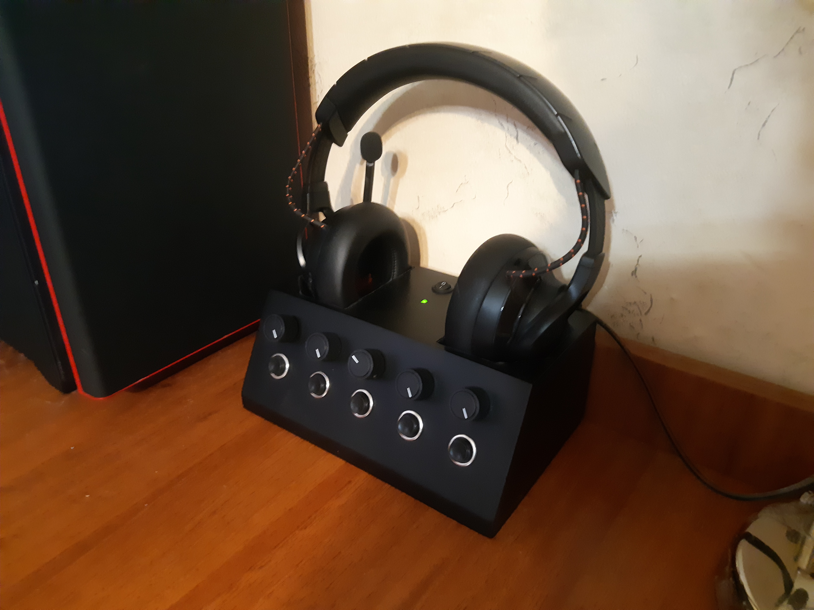

# Charging station
When you need a charging station but a simple charging station is boring!

## Features
* Smart charging station for wireless headphones
* PC volume control useing deej
* Buttons

## Smart charging station
If you keep the headphones or any battery constantly connected to a charger, the battery life will diminish.
So the idea is: the arduino is keeping track of the current going through the USB cable to the headphones and when they are charged - a relay cuts the USB cable.
Magnetic USB cable is being used in order to make the usage easy.
When the headphones are put on the station the charge begins. When they are charged it stops and does not start again until the headphones are taken off and put on again (or a button is toggled).

## Volume control
Uses the [deej](https://github.com/omriharel/deej#license) project.
Slightly simplified the original code to get rid of some buggy interactions.

Quote from the deej readme:

"deej is an open-source hardware volume mixer for Windows and Linux PCs. It lets you use real-life sliders (like a DJ!) to seamlessly control the volumes of different apps (such as your music player, the game you're playing and your voice chat session) without having to stop what you're doing."

## Buttons
Using the HID-Project library - has a full set of multimedia keys.
Added the function to switch the default playback device (Speakers to Headphones and vice versa) with a single press of a button, using [SoundSwitch app](https://github.com/Belphemur/SoundSwitch).

## Pictures

